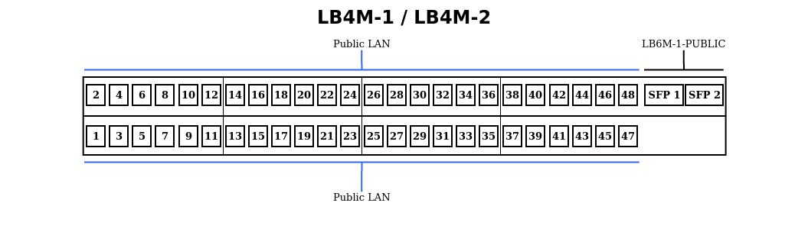
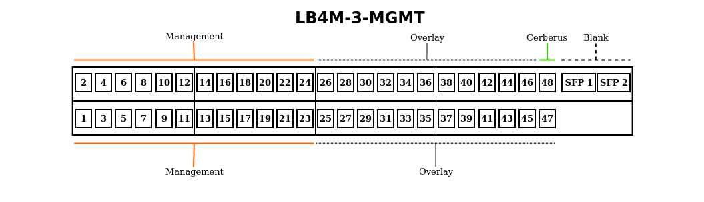
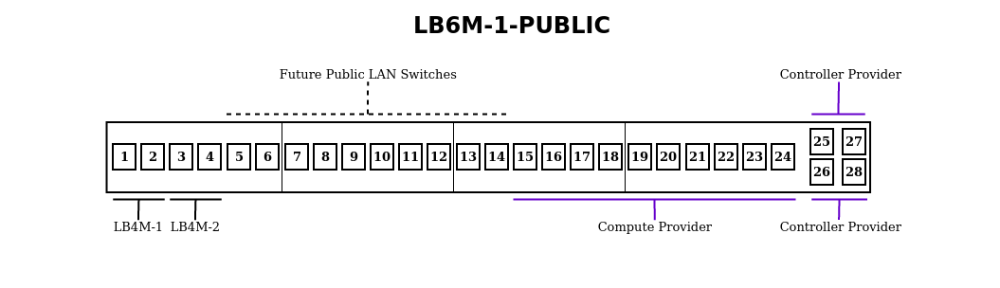
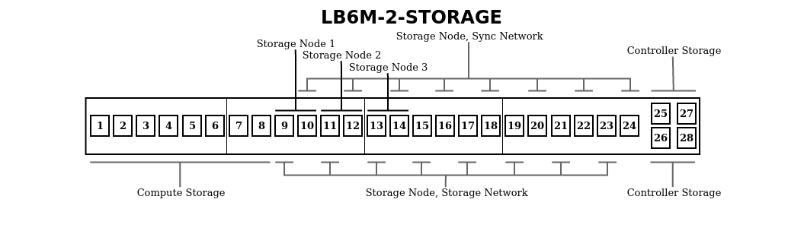

========
Hardware
========

The server rack in the :ref:`seed-office` contains our network backbone as well
as a 9-node High-Availability OpenStack VM cluster.

Console
=======

We use a Dell PowerEdge 2160AS 16-Port KVM Console Switch(:download:`manual
<_files/Poweredge_2160AS_manual.pdf>`) w/ a PowerEdge 15FP Console
KMM(:download:`install guide <_files/Poweredge_15FP_install.pdf>`,
:download:`user guide <_files/Poweredge_15FP_user.pdf>`).

We have a combination of USB & PS/2 KVM Ethernet Cables, the Computes use
USB cables while the Controller & Storage nodes use PS/2.

.. seealso::

    :ref:`How to Switch Between Hosts on the KVM <switch-hosts-guide>`

.. _switch-hardware:

Switches
=========

We've got 3 LB4M(:download:`manual <_files/LB4M_manual.pdf>`) & 2
LB6M(:download:`manual <_files/LB6M_manual.pdf>`) switches.

The following figures show our tentative plans on subdividing the switch ports
between networks. Tables follow, showing which nodes are currently hooked up to
which ports.

.. seealso::

    :ref:`cluster-hardware` for information on each node's NIC, Network, &
    IP Range.

.. _lb4m-1:

LB4M-1
------

    See the :ref:`seed-office` section for a map of Patch Panel Ports to Wall
    Jacks.

    =====       ===========================
    Port        Host
    =====       ===========================
    SFP 1       :ref:`LB6M-1-PUBLIC` Port 1
    SFP 2       :ref:`LB6M-1-PUBLIC` Port 2
    =====       ===========================

.. _lb4m-2:

LB4M-2
------

    See the :ref:`seed-office` section for a map of Patch Panel Ports to Wall
    Jacks.

    =====       ===========================
    Port        Host
    =====       ===========================
    SFP 1       :ref:`LB6M-1-PUBLIC` Port 3
    SFP 2       :ref:`LB6M-1-PUBLIC` Port 4
    =====       ===========================

.. _lb4m-3-mgmt:

LB4M-3-MGMT
-----------

    ..

    =====   ===================         =====   ===========================
    Port    Host                        Port    Host
    =====   ===================         =====   ===========================
    1       stack-controller-1          25      stack-controller-1
    2       stack-controller-2          26      stack-controller-2
    3       stack-controller-3          27      stack-controller-3
    4       stack-compute-1             28      stack-compute-1
    5       stack-compute-2             29      stack-compute-2
    6       stack-compute-3             30      stack-compute-3
    7       stack-storage-1             31
    8       stack-storage-2             32
    9       stack-storage-3             33
    10                                  34
    11                                  35
    12                                  36
    13                                  37
    14                                  38
    15                                  39
    16                                  40
    17                                  41
    18                                  42
    19                                  43
    20                                  44
    21                                  45
    22                                  46
    23                                  47
    24                                  48      :ref:`cerberus`
    _       _                           SFP 1   :ref:`LB6M-1-PUBLIC` Port 1
    _       _                           SFP 2   :ref:`LB6M-1-PUBLIC` Port 2
    =====   ===================         =====   ===========================

.. _lb6m-1-public:

LB6M-1-PUBLIC
-------------

    ..

    =====   ===================         =====   ====================
    Port    Host                        Port    Host
    =====   ===================         =====   ====================
    1       :ref:`LB4M-1` SFP 1         13
    2       :ref:`LB4M-1` SFP 2         14
    3       :ref:`LB4M-2` SFP 1         15      stack-compute-1
    4       :ref:`LB4M-2` SFP 2         16      stack-compute-2
    5                                   17      stack-compute-3
    6                                   18
    7                                   19
    8                                   20
    9                                   21
    10                                  22
    11                                  23
    12                                  24
    _       _                           25      stack-controller-1
    _       _                           26      stack-controller-2
    _       _                           27      stack-controller-3
    _       _                           28
    =====   ===================         =====   ====================

.. _lb6m-2-storage:

LB6M-2-STORAGE
--------------

    ..

    =====   =========================   =====   =========================
    Port    Host                        Port    Host
    =====   =========================   =====   =========================
    1       stack-compute-1             13      stack-storage-3 (storage)
    2       stack-compute-2             14      stack-storage-3 (sync)
    3       stack-compute-3             15
    4                                   16
    5                                   17
    6                                   18
    7                                   19
    8                                   20
    9       stack-storage-1 (storage)   21
    10      stack-storage-1 (sync)      22
    11      stack-storage-2 (storage)   23
    12      stack-storage-2 (sync)      24
    _       _                           25      stack-controller-1
    _       _                           26      stack-controller-2
    _       _                           27      stack-controller-3
    _       _                           28
    =====   =========================   =====   =========================

.. _cluster-hardware:

Cluster Nodes
=============

Acorn runs a 9-node OpenStack cluster with 3 controller, 3 compute, & 3 storage
nodes.

Controller Nodes
-----------------

====================  ========================================================
**CPU**               Intel Xeon L5640 6-Core 2.2GHz
**Chassis**           1U Supermicro XC815TQ-560B
**HDD**               250GB OS
**Motherboard**       Supermicro X8DTU-F
**NIC**               2x1GB Onboard & 2x1GB via Supermicro AOC-PG-12+
**PSU**               1x560w
**RAID Controller**   LSI 9211-4i
**RAM**               32GB
====================  ========================================================

The chassis' top cover has a locking screw on it's front-right side.

The OS drive is in the leftmost bay.

NICs
+++++

===================     =========   ============    ============
rear panel location     interface   network         ip range
===================     =========   ============    ============
bottom-left             enp1s0f0    management      10.2.1.11-40
bottom-right            enp1s0f1    overlay         10.3.1.11-40
top-left                enp3s0f0    provider        n/a
top-right               enp3s0f1    storage         10.4.1.11-40
===================     =========   ============    ============

Compute Nodes
--------------

====================  ========================================================
**CPU**               2x AMD Opteron 6172 12-Core 2.1GHz
**Chassis**           1U HP Proliant DL165 D7
**HDD**               1TB OS
**NIC**               4x1GB Onboard & 2x10GB via HP NC522SFP PCI-E
**RAM**               48GB
====================  ========================================================

The chassis' top cover has no locking screw.

The OS drive is in the leftmost bay.

NICs
+++++

=====================   =========   ==========      ============
rear panel location     interface   network         ip range
=====================   =========   ==========      ============
ethernet "4" - top      enp3s0f1    management      10.2.1.41-70
ethernet "3" - bottom   enp3s0f0    overlay         10.3.1.41-70
ethernet "2" - left     enp4s0f1    not used
ethernet "1" - right    enp4s0f0    not used
fiber left              ens1f0      provider        n/a
fiber right             ens1f1      storage         10.4.1.41-70
=====================   =========   ==========      ============

Eventually, we might use the spare 2x 1GB NICs as failovers for the fiber
links, or a fatter overlay pipe.

Storage Nodes
--------------

8x3TB + 2x6TB per node gives us a safe size of 24TB & risky size of 36TB, with
the ability to add 1 more drives per node, or a journal drive.

http://florian.ca/ceph-calculator/

====================  ========================================================
**CPU**               2x Intel Xeon E5645 6-Core 2.4Ghz
**Chassis**           2U Supermicro CSE-826TQ-R800LPB SuperChasis
**HDD**               250GB OS, 8x3TB + 2x6TB SAS Storage
**Motherboard**       Supermicro X8DTN+
**NIC**               2x1GB Onboard & 2x10GB via Supermicro AOC-STGN-i2S
**PSU**               2x800w
**RAID Controller**   8-Ports via Adaptec ASR-5805, 4-Ports via ASR-5405Z
**RAM**               48GB
====================  ========================================================

The chassis' top cover has a locking screw on it's back-left side.

NICs
+++++

===================     =========   ==========      =============
rear panel location     interface   network         ip range
===================     =========   ==========      =============
ethernet left           enp10s0f0   management      10.2.1.71-100
ethernet right          enp10s0f1   not used
fiber top               enp9s0f0    storage         10.4.1.71-100
fiber bottom            enp9s0f1    sync            10.5.1.71-100
===================     =========   ==========      =============

Eventually, we might use the spare 1GB NIC as a failover for a fiber link.

HDDs
+++++

This is the order the OS sees the drives as being in:

==========  ====    ==  ==  =====
_           left            right
==========  ====    ==  ==  =====
**top**     11      02  05  08
**middle**  10      01  04  07
**bottom**  09      12  03  06
==========  ====    ==  ==  =====

The OS drive lives in bay ``1``, the 8x 3TB HDDs live in bays ``2`` to ``9``, &
the 2x 6TB HDDs live in bays ``10`` & ``11``.
