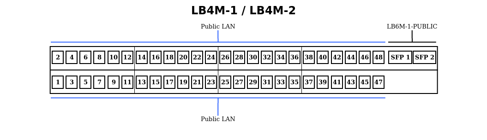
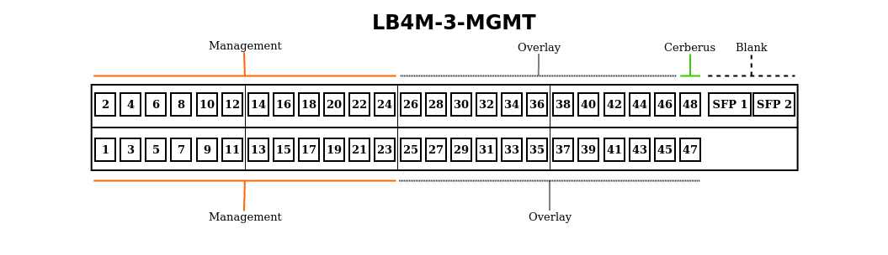
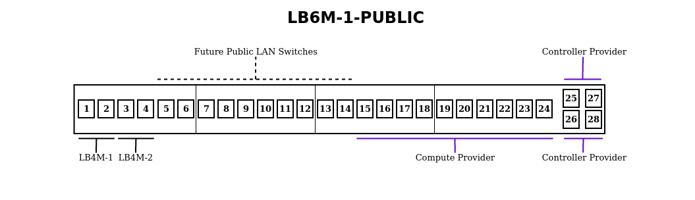
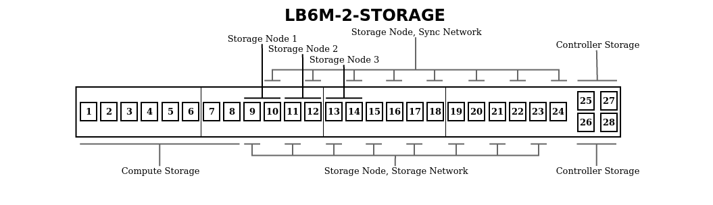

.. _cluster-hardware:

================
Cluster Hardware
================

Acorn runs a 9-node cluster with 3 controller, 3 compute, & 3 storage nodes.

Console Hardware
================

We use a Dell PowerEdge 2160AS 16-Port KVM Console Switch w/ a PowerEdge 15FP
Console KMM.

We have a combination of USB & PS/2 KVM Ethernet Cables, the Computes use
USB cables while the Controller & Storage nodes use PS/2.

To switch between hosts, press ``PrintScreen`` to pop up the selection window,
arrow keys to navigate, and ``Enter`` to select a host.

TODO: Double check the above is true

Network Hardware
=================

TODO: Move this or most of this to the general Architecture page

We have 6 networks:

==================      ==============
Network                 IP CIDR
==================      ==============
Public LAN              192.168.1.0/24
VM LAN                  10.0.1.0/24
Cluster Management      10.2.1.0/24
Cluster Overlay         10.3.1.0/24
Cluster Storage         10.4.1.0/24
Cluster Sync            10.5.1.0/24
==================      ==============

IP addressing of cluster nodes is done manually, using static IPs.

We use the following color-coding for ethernet cabling:

==========  ===================
**RED**     Phone Lines
**YELLOW**  Power over Ethernet
**BLACK**   WAN Line
**GREEN**   Router Link
**ORANGE**  Cluster Management
**WHITE**   Cluster Overlay
**PURPLE**  Cluster Provider
**GREY**    Cluster Storage
==========  ===================

All the Fiber cables are 50/125 OM3, which are aqua colored. We use Juniper
Networks EX-SFP-10GE-SR fiber transceivers.

The office ethernet ports terminate in patch panels(labelled ``A`` & ``B``),
and are connected to 2 Quanta LB4Ms(``LB4M-1`` && ``LB4M-2``, :download:`manual
<_files/LB4M_manual.pdf>`). These LB4Ms connect to a Quanta
LB6M(``LB6M-1-PUBLIC``, :download:`manual <_files/LB6M_manual.pdf>`) which is
used as our public LAN's backbone.

``LB6M-1-PUBLIC`` also connects the managment & overlay switch(``LB4M-3-MGMT``)
to provide nodes internet access.

There is an internal LB6M(``LB6M-2-STORAGE``) connected to the controllers,
computes & storage nodes. This is used for internal data transfer & syncing, it
is not exposed to the User LAN.

The User LAN is our public address space, it is routed to the WAN & to the
Cluster Mangagement network.

The VM LAN is the OpenStack network that the Virtual Machines connect to.
There is no physical hardware, it reside completely within OpenStack. OpenStack
maps these addresses to a User LAN address when you assign a VM a floating IP.

The Cluster Management network is used for cluster nodes to talk to each other
& the WAN(via Cerberus). The Cluster Overlay network is used for internal
communication between VMs. They reside on the same hardware, ``LB4M-3-MGMT``.

The Cluster Storage network is used for communication between the Storage nodes
& the Compute & Controller nodes. The Cluster Sync network is used for syncing
the Storage nodes. The Storage & Sync networks reside ``LB6M-2-STORAGE``.

Switch Layout
-------------

The following figures show our tentative plans on subdividing the switch ports
between networks. Tables follow, showing which nodes are currently hooked up to
which ports.

There will eventually be a map of the Seed Office here showing what jack each
of the Public LAN ports hook up to.

**LB4M-1**

=====       ====================
Port        Host
=====       ====================
SFP 1       LB6M-1-PUBLIC Port 1
SFP 2       LB6M-1-PUBLIC Port 2
=====       ====================

**LB4M-2**

=====       ====================
Port        Host
=====       ====================
SFP 1       LB6M-1-PUBLIC Port 3
SFP 2       LB6M-1-PUBLIC Port 4
=====       ====================

=====   ===================         =====   ====================
Port    Host                        Port    Host
=====   ===================         =====   ====================
1       stack-controller-1          25      stack-controller-1
2       stack-controller-2          26      stack-controller-2
3       stack-controller-3          27      stack-controller-3
4       stack-compute-1             28      stack-compute-1
5       stack-compute-2             29      stack-compute-2
6       stack-compute-3             30      stack-compute-3
7       stack-storage-1             31
8       stack-storage-2             32
9       stack-storage-3             33
10                                  34
11                                  35
12                                  36
13                                  37
14                                  38
15                                  39
16                                  40
17                                  41
18                                  42
19                                  43
20                                  44
21                                  45
22                                  46
23                                  47
24                                  48      Cerberus
_       _                           SFP 1   LB6M-1-PUBLIC Port 1
_       _                           SFP 2   LB6M-1-PUBLIC Port 2
=====   ===================         =====   ====================

=====   ===================         =====   ====================
Port    Host                        Port    Host
=====   ===================         =====   ====================
1       LB4M-1 SFP 1                13
2       LB4M-1 SFP 2                14
3       LB4M-2 SFP 1                15      stack-compute-1
4       LB4M-2 SFP 2                16      stack-compute-2
5                                   17      stack-compute-3
6                                   18
7                                   19
8                                   20
9                                   21
10                                  22
11                                  23
12                                  24
_       _                           25      stack-controller-1
_       _                           26      stack-controller-2
_       _                           27      stack-controller-3
_       _                           28
=====   ===================         =====   ====================

=====   =========================   =====   =========================
Port    Host                        Port    Host
=====   =========================   =====   =========================
1       stack-compute-1             13      stack-storage-3 (storage)
2       stack-compute-2             14      stack-storage-3 (sync)
3       stack-compute-3             15
4                                   16
5                                   17
6                                   18
7                                   19
8                                   20
9       stack-storage-1 (storage)   21
10      stack-storage-1 (sync)      22
11      stack-storage-2 (storage)   23
12      stack-storage-2 (sync)      24
_       _                           25      stack-controller-1
_       _                           26      stack-controller-2
_       _                           27      stack-controller-3
_       _                           28
=====   =========================   =====   =========================

Controller Nodes
=================

====================  ========================================================
**CPU**               Intel Xeon L5640 6-Core 2.2GHz
**Chassis**           1U Supermicro XC815TQ-560B
**HDD**               250GB OS
**Motherboard**       Supermicro X8DTU-F
**NIC**               2x1GB Onboard & 2x1GB via Supermicro AOC-PG-12+
**PSU**               1x560w
**RAID Controller**   LSI 9211-4i
**RAM**               32GB
====================  ========================================================

The chassis' top cover has a locking screw on it's front-right side.

The OS drive is in the leftmost bay.

NICs
-----

===================     =========   ============    ============
rear panel location     interface   network         ip range
===================     =========   ============    ============
bottom-left             enp1s0f0    management      10.2.1.11-40
bottom-right            enp1s0f1    overlay         10.3.1.11-40
top-left                enp3s0f0    provider        n/a
top-right               enp3s0f1    storage         10.4.1.11-40
===================     =========   ============    ============

Compute Nodes
==============

====================  ========================================================
**CPU**               2x AMD Opteron 6172 12-Core 2.1GHz
**Chassis**           1U HP Proliant DL165 D7
**HDD**               1TB OS
**NIC**               4x1GB Onboard & 2x10GB via HP NC522SFP PCI-E
**RAM**               48GB
====================  ========================================================

The chassis' top cover has no locking screw.

The OS drive is in the leftmost bay.

NICs
-----

=====================   =========   ==========      ============
rear panel location     interface   network         ip range
=====================   =========   ==========      ============
ethernet "4" - top      enp3s0f1    management      10.2.1.41-70
ethernet "3" - bottom   enp3s0f0    overlay         10.3.1.41-70
ethernet "2" - left     enp4s0f1    not used
ethernet "1" - right    enp4s0f0    not used
fiber left              ens1f0      provider        n/a
fiber right             ens1f1      storage         10.4.1.41-70
=====================   =========   ==========      ============

Eventually, we might use the spare 2x 1GB NICs as failovers for the fiber
links, or a fatter overlay pipe.

Storage Nodes
==============

6x3TB per node gives us a safe size of 12TB & risky size of 18TB, with the
ability to add 5 more drives per node, or 4 drives & a journal drive.

http://florian.ca/ceph-calculator/

====================  ========================================================
**CPU**               2x Intel Xeon E5645 6-Core 2.4Ghz
**Chassis**           2U Supermicro CSE-826TQ-R800LPB SuperChasis
**HDD**               250GB OS, 6x3TB SAS Storage
**Motherboard**       Supermicro X8DTN+
**NIC**               2x1GB Onboard & 2x10GB via Supermicro AOC-STGN-i2S
**PSU**               2x800w
**RAID Controller**   8-Ports via Adaptec ASR-5805, 4-Ports via ASR-5405Z
**RAM**               48GB
====================  ========================================================

The chassis' top cover has a locking screw on it's back-left side.

NICs
-----

===================     =========   ==========      =============
rear panel location     interface   network         ip range
===================     =========   ==========      =============
ethernet left           enp10s0f0   management      10.2.1.71-100
ethernet right          enp10s0f1   not used
fiber top               enp9s0f0    storage         10.4.1.71-100
fiber bottom            enp9s0f1    sync            10.5.1.71-100
===================     =========   ==========      =============

Eventually, we might use the spare 1GB NIC as a failover for a fiber link.

HDDs
-----

This is the order the OS sees the drives as being in. It's kind of strange,
hopefully an additional RAID card will allow it to be numbered sequentially.

==========  ====    ==  ==  =====
_           left            right
==========  ====    ==  ==  =====
**top**     11      02  05  08
**middle**  10      01  04  07
**bottom**  09      12  03  06
==========  ====    ==  ==  =====

The OS drive lives in bay ``9``, the 6x HDDs live in bays ``4`` to ``8``.
